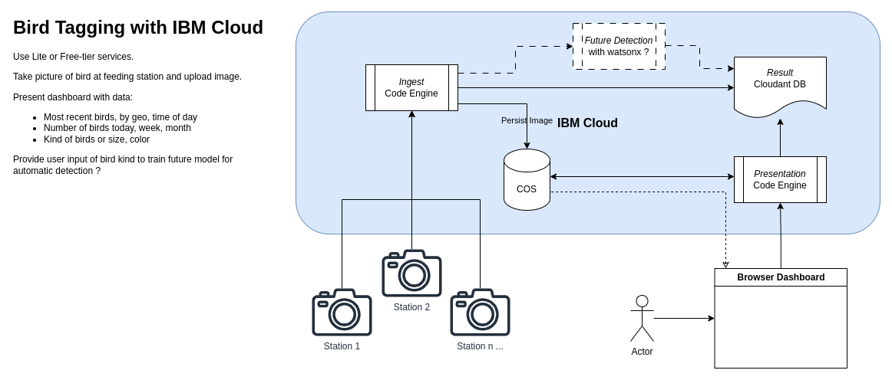

Bird Tagging Demo
=================

This application serves both as *ingest service* and *end-user service*.

## Architecture

We use [Terraform IaC](doc/IaC) to build the IBM Cloud infrastructure.




## Deployment

```shell
./gradlew clean build optimizedDockerBuild
docker login
docker tag birdtag:latest docker.io/mnellemann/birdtag:latest
docker push docker.io/mnellemann/birdtag:latest
```


## Configuration

Environment variables must be configured, see [application.properties](src/main/resources/application.properties) for a list.


## Testing

### Ingest image

```shell
curl -X POST -F "image=@scanner-packaging-01.jpg" -F "station=x" http://localhost:8080/ingest/save
```


## TODO

- Tag image
- Vote up/down on tagged images (on correctness)
- RaspberryPi w. camera and motion sensor
